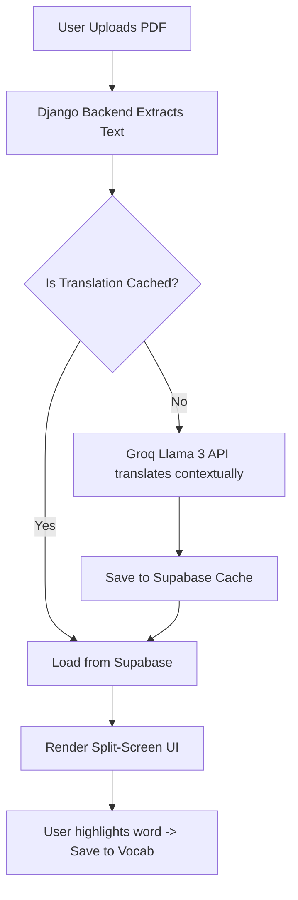

<div align="center">
  
  
  <br/><br/>
  
  # 📖 Anuvad 
  
  **Read Any Book, In Your Own Language**
  
  <p align="center">
    <i>Break the language barrier. Instantly translate and read any book in your native language.</i>
  </p>
  
  <p align="center">
    <a href="https://book-translation.onrender.com"><b>🌍 View Live Demo</b></a> •
    <a href="#-key-features"><b>✨ Features</b></a> •
    <a href="#-how-it-works"><b>⚙️ How it Works</b></a> •
    <a href="#-quick-start"><b>🚀 Quick Start</b></a>
  </p>

  [](https://python.org)
  [](https://djangoproject.com)
  [](https://groq.com)
  [](https://book-translation.onrender.com)
</div>

<br/>

## 🌟 Why Anuvad?
For millions of readers in India, English literature holds immense value, but the language barrier often prevents deep immersion. Traditional translation apps strip away the formatting, context, and joy of reading a real book. 

**Anuvad** (अनुवाद) is built to solve this. It's not just a translator; it's a complete, AI-powered reading ecosystem. You upload a standard English PDF, and Anuvad renders it beautifully while providing side-by-side, context-aware translations in **Pure Hindi** or relatable **Hinglish**.

---

## ✨ Key Features

### 📚 Smart Translation Engine
Upload any English PDF and get immediate, context-aware translations mapped page-by-page. Toggle instantly between Pure Hindi or conversational Hinglish to suit your absolute comfort level.

### 🧠 Vocabulary Vault
Don't break your flow to open a dictionary. Simply tap on any difficult English word while reading to get its contextual meaning. The word is automatically saved to your personal **Vocabulary Vault** for later review.

### 🤖 Chat with Your Book (Ask AI)
Got a question about a confusing plot point? Need a summary of the current chapter? Use the built-in **Ask Book** feature to chat directly with an AI that understands the exact context of the pages you are reading.

### 🧘 Zen Mode (Distraction-Free)
Activate Zen Mode to immerse yourself in reading. Features a built-in Pomodoro timer and ambient background audio (Rain, Ocean Waves, Coffee Shop) to keep you perfectly focused.

### ⚡ Lightning Fast Caching
Translations are intelligently cached in a Supabase PostgreSQL database. Once a page is translated by the AI, it loads instantly forever.

---

## 📸 Screenshots

*(Add your screenshots here by replacing the placeholder links)*

| Dashboard | Reading Mode | Ask AI Chat |
| :---: | :---: | :---: |
|  |  |  |

---

## ⚙️ How it Works



---

## 🛠️ Tech Stack

- **Backend:** Django, Python 3.14
- **Database:** PostgreSQL (Supabase)
- **Frontend:** Vanilla JS, Custom CSS (Glassmorphism, Dark Mode)
- **AI Engine:** Groq API (Llama 3) for blazing-fast inference
- **Auth:** Django Allauth (Google OAuth integration)

---

## 🚀 Quick Start (Local Development)

Want to run Anuvad locally? Follow these simple steps:

### 1. Clone the repository
```bash
git clone https://github.com/ajay160380/book-translation.git
cd book-translation
```

### 2. Set up the Environment
```bash
python3 -m venv .venv
source .venv/bin/activate
pip install -r requirements.txt
```

### 3. Configure Environment Variables
Create a `.env` file in the root directory and add your credentials:
```env
GROQ_API_KEY=your_groq_api_key
DATABASE_URL=your_postgres_db_url

# Optional (For Google Login)
GOOGLE_CLIENT_ID=your_client_id
GOOGLE_CLIENT_SECRET=your_client_secret
```

### 4. Run Migrations & Server
```bash
python manage.py makemigrations
python manage.py migrate
python manage.py runserver
```
Visit `http://127.0.0.1:8000` in your browser to start reading!

---

## 🤝 Contributing
Contributions, issues, and feature requests are welcome! Feel free to check the [issues page](https://github.com/ajay160380/book-translation/issues) if you want to contribute.

## 📄 License
This project is [MIT](https://opensource.org/licenses/MIT) licensed.

<br/>
<div align="center">
  <i>Built with ❤️ for a language-barrier-free world.</i>
</div>
