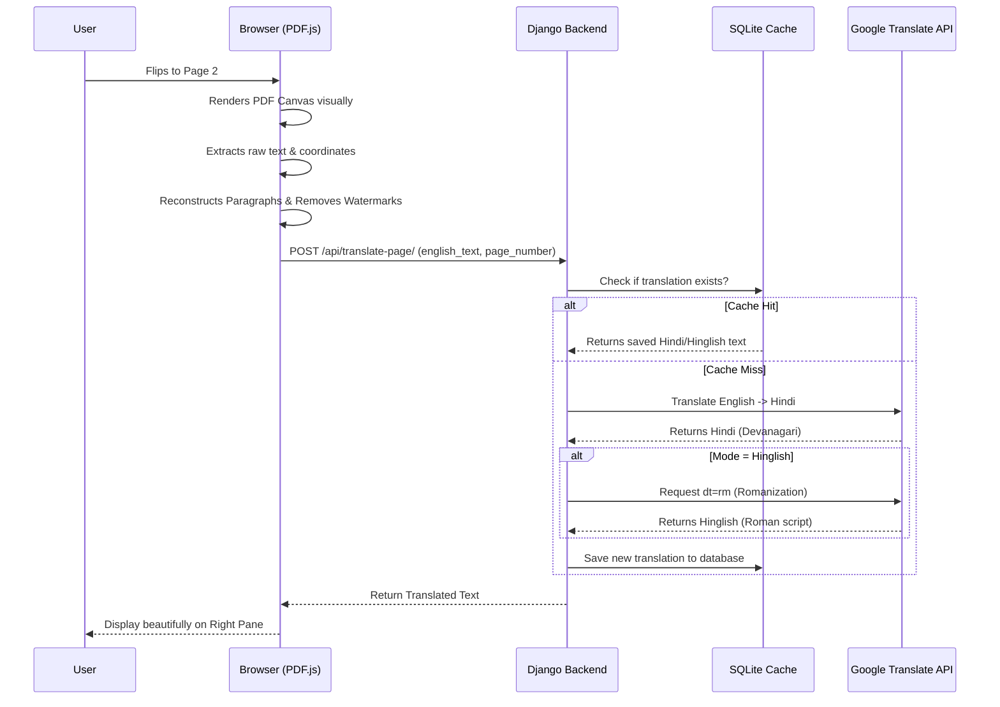
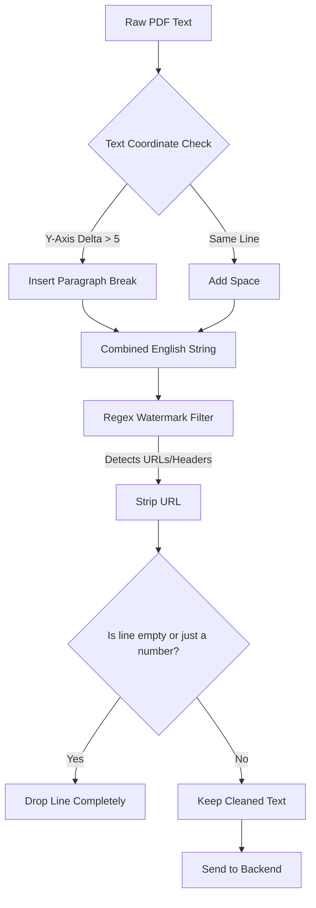

<div align="center">
  
# 📖 Anuvad.ai — The Ultimate PDF Translator
**Read any English PDF book in natural Hindi or Hinglish without losing the layout.**

[](https://www.djangoproject.com/)
[](https://developer.mozilla.org/en-US/docs/Web/JavaScript)
[](https://mozilla.github.io/pdf.js/)
[](#)

</div>

<br>

Anuvad.ai is a premium, minimal, and highly optimized web application that allows users to upload English PDF books and instantly read them side-by-side in **Hindi** or **Hinglish** (Romanized Hindi).

Unlike traditional translation tools that destroy the formatting of PDFs, Anuvad renders the original PDF intact and uses **On-Demand Lazy Loading** to translate the text of the *current page* you are reading in real time.

---

## ✨ Features

- **🎨 Luxury Brutalist UI**: A stunning, premium "Swiss Minimalist" design using `Clash Display` and `Satoshi` typography.
- **📄 Pixel-Perfect PDF Rendering**: Renders your actual PDF on the left pane exactly as published using `pdf.js`.
- **⚡ Lazy "On-Demand" Translation**: Translations only run for the specific page you are looking at, saving massive API costs and rendering instantly.
- **🇮🇳 Hindi & Hinglish Support**: Read in pure Devanagari Hindi, or switch instantly to **Hinglish** (*e.g., "yudh ki kala rajya ke liye atyant mahatvapurn hai"*).
- **🧠 Smart Formatting & Watermark Removal**: Automatically detects and drops annoying URL footers/watermarks and perfectly re-constructs paragraphs that PDF extractors normally break.
- **💾 Local Database Caching**: Once a page is translated, it's saved locally to SQLite. Re-reading a page loads in `<50ms`.

---

## 🏗️ Architecture & Workflow

Here is how the translation engine works under the hood when a user flips a page:



---

## 🛠️ Translation Logic Pipeline

We employ a multi-step extraction and translation pipeline to ensure maximum accuracy:



---

## 🚀 Setup & Installation

Follow these steps to run Anuvad.ai on your local machine.

### 1. Clone the repository
```bash
git clone https://github.com/ajay160380/book-translation.git
cd book-translation
```

### 2. Create a Virtual Environment
```bash
python3 -m venv venv
source venv/bin/activate  # On Windows use: venv\Scripts\activate
```

### 3. Install Dependencies
```bash
pip install -r requirements.txt
```

### 4. Run Migrations
Sets up the SQLite database and translation cache schemas.
```bash
python manage.py migrate
```

### 5. Start the Development Server
```bash
python manage.py runserver
```

Open your browser and navigate to **`http://127.0.0.1:8000/`**. Upload a PDF and start reading!

---

## 📂 Project Structure

```text
book-translation/
├── config/                 # Django settings & routing
├── reader/                 # Core translation app
│   ├── models.py           # Book & TranslationCache schemas
│   ├── views.py            # API logic and page serving
│   └── urls.py             # App routing
├── templates/
│   └── reader/
│       ├── upload.html     # The Landing/Upload page
│       └── reader.html     # The Split-Screen reader UI
├── requirements.txt        # Python dependencies
└── manage.py               # Django entrypoint
```

---

*Designed and Built by Ajay Vishwakarma. Contributions by aryamady.*
